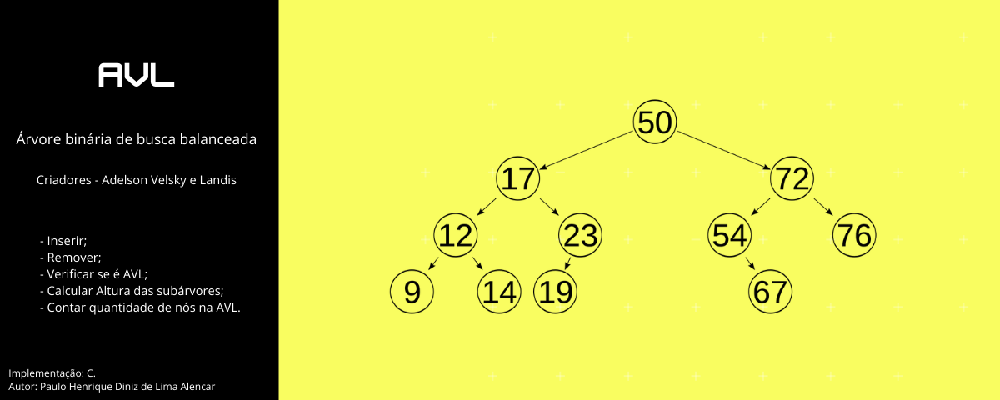

# college-work-data-structure-2
- Discipline - Advanced Data Structures
- Student: Paulo Henrique Diniz de Lima Alencar.
- Federal University of Ceara - Campus Russas.

### Description
First work in the Advanced Data Structures discipline.

The work consists:

[Access](https://github.com/pauloh-alc/AVL-tree/tree/main/list-of-questions)

## Questions and files

| 1. AVL - Implementations  | 
| ------------------- | 
|    Exercise - 1 [ok]    |  
|    Exercise - 2 [ok]    |  
|    Exercise - 3 [ok]    |  

| 2. Tests            | 
| -------------------   | 
|    Test - 1 [ok]    |  
|    Test - 2 [ok]    |  
|    Test - 3 [ok]    |  
|    Test - 4 [ok]    |  
|    Test - 5 [ok]    |  

| 3. Presentation       | Access link     |
| -------------------   | ------------------- |
|    Video   | [Access](https://www.google.com/) |  

## Author
Paulo Henrique Diniz de Lima Alencar.

## Language

C

## License

MIT
